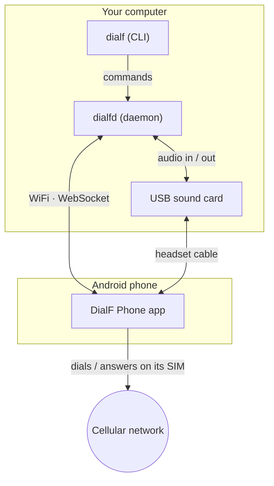
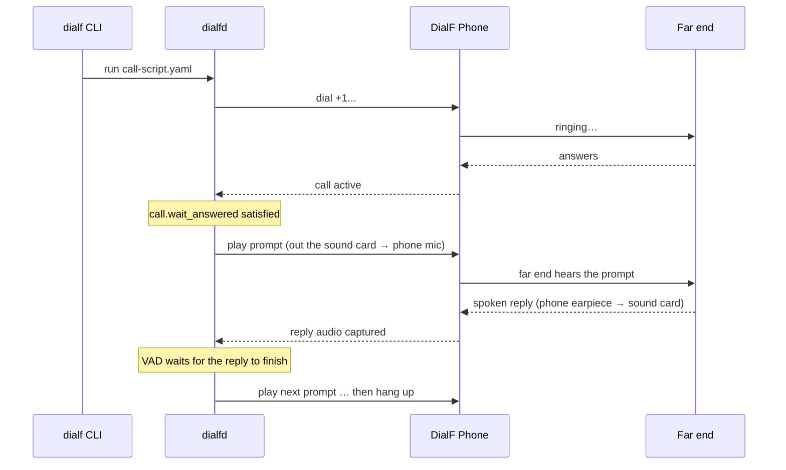
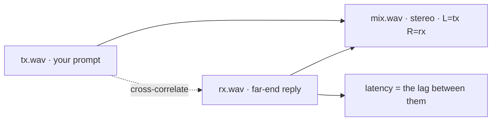

# DialF: Drive a Real Phone From Your Terminal

*A small tool that lets a script place real phone calls, talk, listen, and hang up — on a real SIM, over a real cellular network.*

---

## Why we built this

AI voice agents are everywhere now — and they **live and die by latency and audio quality.** A second of dead air, a stiff robotic voice, or choppy, fluctuating audio is the difference between "sounds human" and "obviously a bot." Yet before every release we were measuring those things *by hand*: dial in, read a script, listen for gaps, do it again on the next build. It didn't scale, and "sounds fine to me" is not a regression test.

What we actually needed was to automate a *real* phone call. Not a VoIP call. Not a simulator. An actual call on an actual carrier — the kind that rings a normal phone, goes through the normal network, and behaves exactly like a human dialing. So we could:

- **Test phone systems end to end** — voice agents, IVRs, call centers, voicemail — the way a real caller experiences them.
- **Run scripted conversations** — play a prompt, wait for the other side to finish talking, play the next one.
- **Record both sides cleanly, on one timeline**, so we could measure **latency** ("how long after I speak does the other side respond?") — as a number, on every build.

The catch: **Android won't let an app record or inject the audio of a cellular call.** That path is locked to the system. So a pure software approach is impossible.

DialF's answer is simple and a little old-school: **bridge the call audio through a real USB sound card.** The phone does the dialing; a sound card plays into the phone's mic and listens on its earpiece. Your computer drives the whole thing — and we know you'll wire your own AI agents up to do the driving.

---

## Why not a programmable 4G module?

It's the first thing every engineer suggests, and it's a fair instinct — a cellular module takes a SIM, speaks AT commands, and dials from a script. Cheap, headless, no human in the loop.

But a module isn't a phone. It carries its own compatibility quirks and behaves in ways real handsets don't — so it can quietly alter the very thing you're trying to measure. You end up testing the module's behavior, not your users' calls.

That's the crux: **a voice agent's audio path *is* the product, and a module only tests a synthetic version of it.** Your agent can sound flawless through a module and still ship stutter and echo through a real earpiece — and the module never warns you, because it was never on the path your callers actually hear. DialF drives a real phone for exactly that reason.

---

## What it does

DialF turns a phone into something you can script:

- 📞 **Make, answer, reject, and hang up calls** — on the phone's own SIM.
- 💬 **Send and read SMS**, read the **call log** and **SIM list** (dual-SIM aware).
- 🎛️ **Carrier controls** — toggle voicemail, run raw MMI/USSD codes.
- 🗣️ **Scripted voice conversations** — play audio prompts, and *wait for the person to stop talking* using voice-activity detection before moving on.
- 🎙️ **Record the call** full-duplex — your audio (`tx`), their audio (`rx`), and a **stereo mix** (left = you, right = them), all the same length and sample-aligned (great for latency analysis).

You drive all of it from one command-line tool, or from a small YAML script.

---

## How it works

DialF has two parts that talk to each other, plus a deliberate split between **control** and **audio**:



- **Control plane (over WiFi):** the `dialf` CLI sends commands to the `dialfd` daemon, which relays them to the **DialF Phone** app over a WebSocket. This is how dial / answer / SMS / hang up happen. No audio travels here.
- **Audio plane (physical):** call audio flows through a **USB sound card** wired to the phone's headset jack. The card plays *into* the phone's microphone and records *from* its earpiece. The app just routes the call to the wired headset.

Why the split? Because Android blocks call-audio capture in software — so audio has to be bridged physically, never over WiFi.

### A scripted call, step by step



---

## How to use it

### 1. Install the CLI (macOS or Linux)

```sh
npm install -g @agora-build/dialf
# or:  curl -fsSL https://dl.agora.build/dialf/install.sh | bash
```

Then start the background daemon:

```sh
dialf service install --user      # runs dialfd at login
```

> On a Mac or laptop, keep `--user` — it runs as you, when you log in (needed so it can reach the sound card and mic). Use plain `dialf service install` (with `sudo`) only on a headless Linux server that should start at boot.

### 2. Install the phone app

Sideload the APK on the Android phone (Android 9+):

- **Latest release (default):** <https://github.com/Agora-Build/DialF/releases>
- or <https://dl.agora.build/dialf/dialf-phone-latest.apk>

Open it, grant phone/SMS permissions, and **set it as the default dialer** (that's what lets it place and track calls).

### 3. Pair them

In the app, enter the same **shared key** as your `dialfd` config and tap **Start service**. The phone finds the daemon automatically on your WiFi (mDNS). Confirm it's connected:

```sh
dialf devices        # your phone should appear
```

### 4. Drive it

```sh
dialf call dial   <phone> +15551234        # place a call
dialf call hangup <phone>                  # hang up
dialf sms  send   <phone> +15551234 "hi"   # send a text
dialf call list   <phone> --human          # read the call log
dialf --version                            # CLI + daemon versions
```

### 5. Script a conversation

Jobs are plain YAML — a list of steps run in order:

```yaml
- type: call.dial
  number: "+15551234"
- type: call.wait_answered      # wait for a real answer, not a fixed timer
  timeout_ms: 30000
- type: audio.play              # inject a prompt into the call
  file: samples/prompt-en-1.wav
- type: audio.wait_for_speech   # listen until the other side stops talking
  end_timeout_ms: 45000
  silence_duration_ms: 3000
- type: sms.send
  to: "+15551234"
  body: "thanks!"
- type: call.hangup
```

```sh
dialf run call-script.yaml
```

`audio.wait_for_speech` is the clever bit: it runs voice-activity detection on the incoming audio, so the script moves on **when the person actually finishes speaking** — not after a guess.

---

## Recording and latency

If you turn on recording, every call is written as **three aligned WAV files**:

- `…-tx.wav` — what you sent (your prompts), mono
- `…-rx.wav` — what the far end said, mono
- `…-mix.wav` — **stereo**: left = tx (you), right = rx (them), so the two voices stay separated (swap with `mix_channels: rx_tx`)

They're captured on a **single clock**, so they line up sample-for-sample. That makes latency measurable: cross-correlate `tx` against `rx` and the offset is your round-trip delay.



---

## Wrapping up

DialF is a thin, scriptable bridge between your terminal and a real phone. The control side is clean software over WiFi; the audio side is honest about hardware — a sound card doing what software isn't allowed to. Together they let a few lines of YAML place a call, hold a conversation, and hand you a clean recording.

It runs on macOS and Linux, the CLI installs from npm, and the phone app is a sideloadable APK. If you've ever wanted to put a real phone call inside a `for` loop — that's the idea.

---

## License

DialF is released under the **MIT License**.

**Disclaimer:** This tool is strictly for engineering use only and must not be used for any illegal purposes. The user bears all legal consequences arising from its use.
